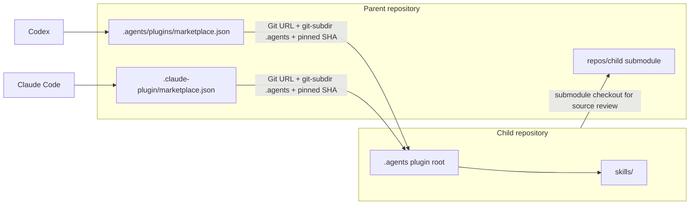

# AI Agent Workspace Template

A [Copier](https://copier.readthedocs.io/) template for generic, AI-agent-ready Python and JavaScript workspaces.

## Usage

Install Copier and Git. Install mise, uv, and pnpm when selecting the related
optional steps.

```sh
# Create a repository from the published template.
# Copier prompts for the project name, slug, and description.
# Git initialization is enabled by default. Toolchain installation and lockfile
# generation are disabled by default; neither lockfile is stored in the template.
# --trust permits the template's explicitly declared tasks.
copier copy --trust https://github.com/japboy/agent-workspace-template.git /path/to/new-repository

# From the generated repository, after committing or otherwise resolving local
# changes, update from the template recorded in .copier-answers.yml.
copier update --trust
```

When both optional toolchain installation and lockfile generation are selected,
Copier runs lock generation through `mise exec`; otherwise it uses compatible
`uv` and `pnpm` already on `PATH`.

## Generated baseline

- `project_slug` is the shared kebab-case repository, package, and plugin
  identifier.
- `AGENTS.md` and `CLAUDE.md` define agent operating constraints.
- `ARCHITECTURE.md` owns repository-local architecture and invariants.
- `.agents` is a self-contained Codex and Claude Code plugin; its `skills/`
  directory is the shared uv and pnpm workspace member.
- `.claude/skills` links to `.agents/skills` for local Claude Code discovery.
- Public dependencies use Takumi Guard proxies, have a three-day maturity
  window, and require explicit pnpm build-script approval.
- Generated `README.md` files contain only the project title and description;
  use them for project-specific purpose, audience, and onboarding.

## Intended use case

Use this template for either role in a parent-and-child workspace. A child
repository owns reusable Agent Skills. A parent repository groups child
repositories for coordinated source review and catalogs their plugins for
installation. Every generated repository can serve both roles.

### Distribution flow



- `repos/` is reserved for child Git submodules. It is paired with an empty
  `.gitmodules` file, which `git submodule add <url> repos/<child>` updates.
- Parent repositories may use submodules for review and coordinated changes,
  but marketplaces fetch each child from its own Git URL.
- Each marketplace entry selects `.agents` with `git-subdir` and pins a full
  child commit SHA.
- Codex entries live in `.agents/plugins/marketplace.json` and use
  `"path": "./.agents"`; Claude Code entries live in
  `.claude-plugin/marketplace.json` and use `"path": ".agents"`.
- Use `project_slug` for the Copier destination directory and Git repository
  name; Copier cannot infer a remote repository name from its output path.

## References

- [Copier documentation](https://copier.readthedocs.io/)
- [Codex plugin guide](https://learn.chatgpt.com/docs/build-plugins)
- [Claude Code marketplace guide](https://code.claude.com/docs/en/plugin-marketplaces)
