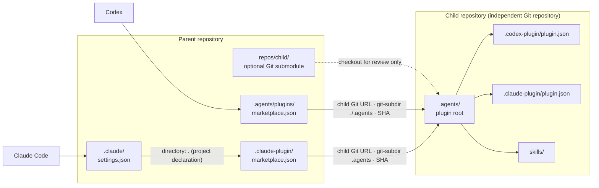

# AI Agent Workspace Template

A [Copier](https://copier.readthedocs.io/) template for generic, AI-agent-ready Python and JavaScript workspaces.

## Usage

Install Copier and Git. Install mise, uv, and pnpm when selecting the related
optional steps.

```sh
# Create a repository from the published template.
# Copier prompts for the project name, slug, and description.
# Git initialization is enabled by default. Toolchain installation and lockfile
# generation are disabled by default; neither lockfile is stored in the template.
# --trust permits the template's explicitly declared tasks.
copier copy --trust https://github.com/japboy/agent-workspace-template.git /path/to/new-repository

# From the generated repository, after committing or otherwise resolving local
# changes, update from the template recorded in .copier-answers.yml.
copier update --trust
```

When both optional toolchain installation and lockfile generation are selected,
Copier runs lock generation through `mise exec`; otherwise it uses compatible
`uv` and `pnpm` already on `PATH`.

### Repository naming

Use `project_slug` for the Copier destination directory and Git repository
name; Copier cannot infer a remote repository name from its output path.

## Generated baseline

- `project_slug` is the shared kebab-case repository, package, and plugin
  identifier.
- `AGENTS.md` and `CLAUDE.md` define agent operating constraints.
- `ARCHITECTURE.md` owns repository-local architecture and invariants.
- `.agents` is a self-contained Codex and Claude Code plugin; its `skills/`
  directory is the shared uv and pnpm workspace member.
- `.claude/skills` links to `.agents/skills` for local Claude Code discovery.
- `.claude/settings.json` declares this repository's Claude Code marketplace
  through a relative `directory` source, with no child plugin enabled initially.
- Both parent-marketplace catalogs are created empty. They make the parent role
  explicit without selecting, pinning, or installing any child plugin.
- Public dependencies use Takumi Guard proxies, have a three-day maturity
  window, and require explicit pnpm build-script approval.
- Generated `README.md` files contain only the project title and description;
  use them for project-specific purpose, audience, and onboarding.

## Parent–child plugin distribution

This template deliberately uses a **child-as-plugin / parent-as-marketplace**
topology. A child repository remains an independent source repository and owns
its plugin. A parent repository chooses which child plugins to show in its
catalog. Every generated repository can take either role, or both.

| Role | Owns | Codex path | Claude Code path |
| --- | --- | --- | --- |
| Child plugin | The reusable package and its skills | `.agents/.codex-plugin/plugin.json` | `.agents/.claude-plugin/plugin.json` |
| Parent marketplace | A named catalog of deliberately selected child sources | `.agents/plugins/marketplace.json` | `.claude-plugin/marketplace.json` |
| Git submodule | An optional checkout for review and coordinated source changes | `repos/<child>/` | `repos/<child>/` |

A marketplace is a catalog, not the plugin payload. A marketplace entry
explicitly maps a child plugin name to its Git URL, `git-subdir`, and selected
revision. A submodule does not publish, install, or recursively discover a
plugin. The catalog name is the parent-owned namespace: for example,
`child-tools@parent-workspace` combines the child plugin name with the parent
marketplace name.

Every generated catalog starts with `"plugins": []`; no child is selected or
installed until the parent adds an entry. The generated Claude Code settings
also begin with an empty `enabledPlugins` map.

### Distribution flow



### Example: one child plugin

The child owns one `.agents/` plugin root. Both agent-specific manifests share
the same plugin identity and `skills/` payload; the generated Codex manifest
also adds optional install-surface metadata.

```text
child-tools/
└── .agents/
    ├── .codex-plugin/plugin.json
    ├── .claude-plugin/plugin.json
    └── skills/
```

```json
{
  "name": "child-tools",
  "version": "0.1.0",
  "description": "Reusable Agent Skills from child-tools.",
  "author": {
    "name": "Child Team"
  },
  "skills": "./skills/"
}
```

### Example: parent catalogs

The following entries are intentional parent choices, not template defaults.
Replace the example URL and SHA with the child repository and revision that the
parent elects to distribute; the optional `repos/child-tools/` checkout is not
their source.

`parent/.agents/plugins/marketplace.json` for Codex:

```json
{
  "name": "parent-workspace",
  "interface": {
    "displayName": "Parent Workspace"
  },
  "plugins": [
    {
      "name": "child-tools",
      "source": {
        "source": "git-subdir",
        "url": "https://github.com/example/child-tools.git",
        "path": "./.agents",
        "sha": "0123456789abcdef0123456789abcdef01234567"
      },
      "policy": {
        "installation": "AVAILABLE",
        "authentication": "ON_INSTALL"
      },
      "category": "Productivity"
    }
  ]
}
```

`parent/.claude-plugin/marketplace.json` for Claude Code:

```json
{
  "name": "parent-workspace",
  "owner": {
    "name": "Parent Workspace"
  },
  "description": "Plugins curated by Parent Workspace.",
  "plugins": [
    {
      "name": "child-tools",
      "source": {
        "source": "git-subdir",
        "url": "https://github.com/example/child-tools.git",
        "path": ".agents",
        "sha": "0123456789abcdef0123456789abcdef01234567"
      },
      "description": "Reusable Agent Skills from child-tools."
    }
  ]
}
```

### Parent marketplace registration

Catalog contents and agent registration are separate concerns.

#### Claude Code

The generated project settings make the parent catalog available without each
user first running a registration command. The relative `directory` path
resolves from the repository's main checkout, not from `.claude/`.

The template starts with an empty `enabledPlugins` map. After the parent adds
`child-tools` to `.claude-plugin/marketplace.json`, make this single change:

```diff
-  "enabledPlugins": {}
+  "enabledPlugins": {
+    "child-tools@parent-workspace": true
+  }
```

This is an explanatory diff, not literal JSON: the `+` lines are the only
addition and their leading `+` characters are not part of `settings.json`.

Claude Code still prompts each user to trust and install the marketplace and
plugin. The local `directory` source is appropriate for self-consumption during
development; use a Git source when the marketplace must be consumed without a
checked-out parent repository.

#### Codex

Codex has no equivalent project registration in `.codex/config.toml`. Its
desktop app discovers the repo catalog at `.agents/plugins/marketplace.json`
directly. A CLI registration is optional, user-scoped state and is therefore
not generated by this template:

```sh
# Run from the parent repository root; this writes $CODEX_HOME state.
codex plugin marketplace add .
codex plugin add child-tools@parent-workspace
```

The parent catalog references a child plugin; it does not import the child's
marketplace. In Codex, installing and enabling a formal plugin remains
user-scoped, so a repository catalog is a curation boundary, not a
repository-scoped activation boundary.

## References

- [Copier documentation](https://copier.readthedocs.io/)
- [Codex plugin structure and marketplace metadata](https://learn.chatgpt.com/docs/build-plugins)
- [Codex user-scope plugin activation source](https://github.com/openai/codex/blob/4477b20713f55ce2533618fbcf3d3d7ff7d8ca25/codex-rs/core-plugins/src/manager.rs#L1457-L1513)
- [Claude Code marketplace schema and plugin sources](https://code.claude.com/docs/en/plugin-marketplaces)
- [Claude Code project plugin settings](https://code.claude.com/docs/en/settings#plugin-settings)
